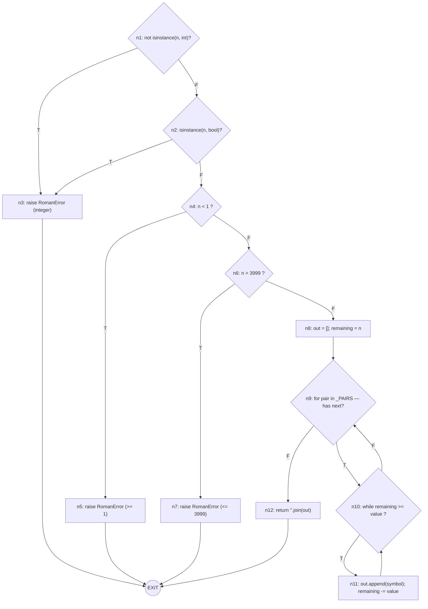

# Testing life cycle — report

**Student:** Nahin Cevallos (`nhn2004`, njcevall@espol.edu.ec)
**System under test:** `roman` — Roman numeral converter (`src/roman/converter.py`).
**Specification:** `SPECIFICATION.md` at the repository root (referred to below as "the spec").

---

## 1. Control flow graph of `to_roman`

The target function is `to_roman(n)` (lines 40–53 of `converter.py` in the inherited
version, before any fix). The compound predicate
`if not isinstance(n, int) or isinstance(n, bool)` is decomposed into two
decision nodes as required by the rubric.

### 1.1 Nodes

| Node | Statement or predicate |
|---|---|
| n1  | `not isinstance(n, int)` — decision (short-circuit OR, first operand) |
| n2  | `isinstance(n, bool)` — decision (short-circuit OR, second operand) |
| n3  | `raise RomanError("value must be an integer")` |
| n4  | `n < _MIN_VALUE` — decision |
| n5  | `raise RomanError("value must be >= 1")` |
| n6  | `n > _MAX_VALUE` — decision |
| n7  | `raise RomanError("value must be <= 3999")` |
| n8  | `out = []`; `remaining = n` (block, no branching) |
| n9  | `for value, symbol in _PAIRS:` — decision (has next pair?) |
| n10 | `while remaining >= value:` — decision |
| n11 | `out.append(symbol)`; `remaining -= value` (loop body) |
| n12 | `return "".join(out)` |
| EXIT | virtual single exit node |

### 1.2 Diagram



### 1.3 Cyclomatic complexity

Counting edges and nodes on the graph above:

- **N = 13** nodes (n1..n12 plus the virtual EXIT).
- **E = 18** edges:
  1. n1→n3, 2. n1→n2, 3. n2→n3, 4. n2→n4,
  5. n4→n5, 6. n4→n6, 7. n6→n7, 8. n6→n8,
  9. n8→n9, 10. n9→n10, 11. n9→n12,
  12. n10→n11, 13. n10→n9, 14. n11→n10,
  15. n3→EXIT, 16. n5→EXIT, 17. n7→EXIT, 18. n12→EXIT.

$$V(G) = E - N + 2 = 18 - 13 + 2 = \mathbf{7}$$

Cross-check by predicate count: 6 decisions (n1, n2, n4, n6, n9, n10) + 1 = 7. ✔

### 1.4 Basis set of 7 linearly independent paths

Each path is written as a sequence of nodes from n1 to EXIT.

| # | Path | Meaning |
|---|---|---|
| P1 | n1 → n3 → EXIT | `n` is not an int (e.g. `to_roman("5")`) |
| P2 | n1 → n2 → n3 → EXIT | `n` is an int but also a bool (e.g. `to_roman(True)`) |
| P3 | n1 → n2 → n4 → n5 → EXIT | `n < 1` (e.g. `to_roman(0)`) |
| P4 | n1 → n2 → n4 → n6 → n7 → EXIT | `n > 3999` (e.g. `to_roman(4000)`) |
| P5 | n1 → n2 → n4 → n6 → n8 → n9 → n12 → EXIT | Valid `n`, `_PAIRS` empty (theoretical — the loop is never entered) |
| P6 | n1 → n2 → n4 → n6 → n8 → n9 → n10 → n9 → … → n12 → EXIT | Valid `n`, iterate pairs, `while` never enters for at least one pair (e.g. `to_roman(1)` — most pairs skipped) |
| P7 | n1 → n2 → n4 → n6 → n8 → n9 → n10 → n11 → n10 → n9 → … → n12 → EXIT | Valid `n`, at least one iteration of the `while` body (e.g. `to_roman(3999)`) |

### 1.5 Definition-use table

For each variable, `def` marks the point where it is assigned, and each use is
classified as **c-use** (computational, in a right-hand side or argument) or
**p-use** (predicate, appears inside a decision). The variable `remaining` is
redefined inside the loop at n11, which creates additional pairs.

| Variable | Definition | Uses (node · kind) |
|---|---|---|
| `n` | parameter (entry) | n1 · p-use; n2 · p-use; n4 · p-use; n6 · p-use; n8 · c-use (`remaining = n`) |
| `out` | n8 (`out = []`) | n11 · c-use (`out.append(...)`); n12 · c-use (`"".join(out)`) |
| `remaining` (def₁) | n8 (`remaining = n`) | n10 · p-use; n11 · c-use (`remaining -= value`) |
| `remaining` (def₂) | n11 (`remaining -= value`, inside the loop) | n10 · p-use *(next iteration)*; n11 · c-use *(same statement, subsequent iteration)* |
| `value` | n9 (loop target) — redefined every iteration | n10 · p-use; n11 · c-use |
| `symbol` | n9 (loop target) — redefined every iteration | n11 · c-use |

**Def-use pairs for `remaining`, including the loop redefinition:**

| Pair | Definition site | Use site | Kind |
|---|---|---|---|
| (def₁, use) | n8 | n10 | p-use (first check of `while` on first pair) |
| (def₁, use) | n8 | n11 | c-use (first entry to the loop body) |
| (def₂, use) | n11 | n10 | p-use (re-check after subtraction) |
| (def₂, use) | n11 | n11 | c-use (subsequent iteration on same pair) |

---

## 2. Integration finding

### 2.1 Test that revealed the defect

`tests/test_integration.py::test_add_result_is_canonical_and_valid`:

```python
def test_add_result_is_canonical_and_valid():
    result = add_roman("II", "II")
    assert result == "IV"
    assert is_valid_roman(result)
```

Captured failure (see `captures/03_integration_falla.txt`):

```
E       AssertionError: assert 'IIII' == 'IV'
```

### 2.2 The defect

In `_PAIRS`, the entry for the subtractive pair *IV* was written as
`(5, "IV")` instead of `(4, "IV")`. The outer loop iterates pairs from
largest to smallest, so when `remaining` reaches 4 the `(5, "V")` pair is
skipped (4 < 5), the buggy `(5, "IV")` entry is also skipped (4 < 5), and the
`(1, "I")` pair emits four `"I"` symbols. The result is `"IIII"`, which is not
canonical (spec §2 forbids four identical symbols in a row).

### 2.3 Why the inherited unit tests pass

The 15 inherited unit tests exercise `to_roman` only for values that do not
require the `(5, "IV")` entry to fire: `1..3, 5, 10, 50, 100, 500, 1000`. None
of them requests a value whose canonical form contains `IV`. `from_roman` is
tested with `"I"`, `"V"`, `"II"`, and the lowercase `"xi"` — none of these
strings hit the composition path either. The defect lives in `_PAIRS`, which
only `to_roman` reads. Because the collaboration
`add_roman → to_roman → is_valid_roman` is never exercised by the inherited
suite, the defect stays hidden at the unit level and surfaces only when two
units are composed and their combined output is checked for canonicality.

---

## 3. Acceptance criteria (Given / When / Then)

All three criteria are derived from `SPECIFICATION.md`, not from the source
code. They are implemented in `tests/test_acceptance.py`.

### Criterion 1 — Section 2, canonical output of `to_roman`

- **Given** a valid integer in the supported range 1..3999,
- **When** `to_roman(1994)` is called,
- **Then** the returned string is exactly `"MCMXCIV"` (the canonical form
  listed as a mandatory reference value in the spec).

### Criterion 2 — Section 3, whitespace tolerance

- **Given** a roman string with leading and trailing blanks
  (`"  IV  "`), input that arrives from a user-facing field where stray
  blanks are common,
- **When** `from_roman("  IV  ")` is called,
- **Then** the function returns `4`, because the spec says leading and
  trailing whitespace must be trimmed.

### Criterion 3 — Section 4, canonical form validation

- **Given** a string that spells a value in a non-canonical way (`"IIII"`,
  which represents 4 but is not the canonical form `IV`),
- **When** `from_roman("IIII")` is called,
- **Then** the function raises `RomanError`, because §4 states that the
  system accepts only canonical form.

### 3.1 Which criteria failed at 90 % branch coverage

At the end of Part 3 the unit-tests branch coverage was **90 %** and the
inherited suite plus the new unit tests were all green, yet all three
acceptance tests failed (see `captures/04_acceptance_fallan.txt`):

- Criterion 1 failed with `assert 'MCMXCIIII' == 'MCMXCIV'` — same defect as
  the integration failure.
- Criterion 2 failed with `RomanError: invalid roman character: ' '` —
  `from_roman` did not trim whitespace.
- Criterion 3 failed with `DID NOT RAISE RomanError` — `from_roman` accepted
  the non-canonical `"IIII"`, returning `4`.

### 3.2 Why coverage cannot reveal a defect of this kind

Branch coverage measures which decisions were exercised, not whether their
outcomes match the specification. Criterion 3 is the clearest example: the
inherited code has **no branch at all** for canonical-form validation, so a
100 % branch coverage figure would still be consistent with accepting
`"IIII"`. A defect that lives in *missing* logic is invisible to any coverage
metric, because there is no code to be covered. Criterion 2 shows the same
kind of defect: the specification requires an operation (`strip()`) that the
code never performs. Only tests derived from the specification, not from the
source code, can detect these functional gaps.

---

## 4. Coverage

Branch coverage was measured with:

```bash
pytest --cov=roman.converter --cov-branch --cov-report=term-missing
```

### 4.1 Before (inherited suite only)

Captured in `captures/01_coverage_inicial.txt`:

```
Name                     Stmts   Miss Branch BrPart  Cover   Missing
--------------------------------------------------------------------
src\roman\converter.py      68     24     34      9    64%   42, 44, 46, 58, 61, 64, 72-74, 79, 83, 88, 92-96, 100-104, 108, 112
--------------------------------------------------------------------
TOTAL                       68     24     34      9    64%
============================= 15 passed in 0.50s ==============================
```

**64 %** branch coverage, 15 tests passing.

### 4.2 After (all fixes applied, complete suite green)

Captured in `captures/06_suite_verde_final.txt`:

```
Name                     Stmts   Miss Branch BrPart  Cover   Missing
--------------------------------------------------------------------
src\roman\converter.py      72      8     36      2    87%   95, 99, 104, 108-112
--------------------------------------------------------------------
TOTAL                       72      8     36      2    87%
============================= 52 passed in 0.62s ==============================
```

**87 %** branch coverage (above the 85 % threshold), **52 tests passing, zero
failures**. The remaining uncovered lines belong to the two private helpers
`_roundtrip_differs` and `_count_char`, which the module defines but never
calls (they are dead code inherited from the original repository).

### 4.3 Defects fixed

Three separate commits, each mapped to the level of testing that found it:

| # | Commit message | Level | Spec section |
|---|---|---|---|
| 1 | `fix(unit): correct subtractive pair for 4 per spec section 2` | integration (surfaced), unit test coverage supported | §2 |
| 2 | `fix(acceptance): trim leading/trailing whitespace in from_roman per spec section 3` | acceptance | §3 |
| 3 | `fix(acceptance): reject non-canonical roman numerals per spec section 4` | acceptance | §4 |

The 15 inherited tests in `tests/test_converter.py` were **not modified**.
